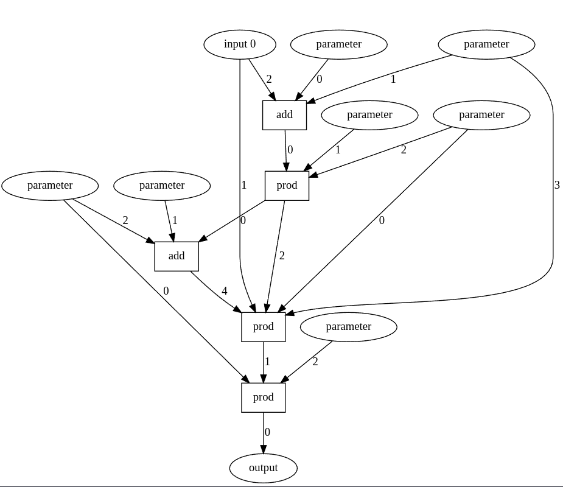
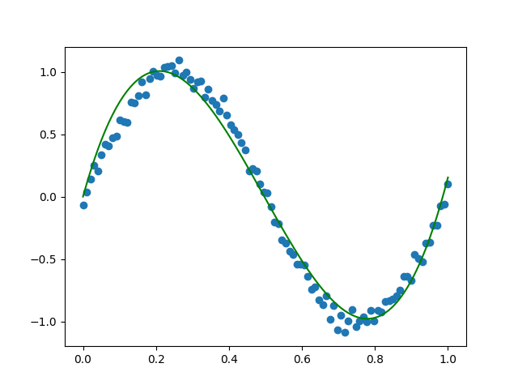

# Unconstrained evolution of neural networks

In this project, I'm exploring whether we can evolve neural network architectures in a very unconstrained manner.

To do this, I use computational graphs, which can then be mutated randomly.

Right now, the computational graphs only work with numbers, not tensors. Evolving computational graphs
that work with tensors is a future goal.

Here is an interesting architecture, evolved to learn a single wavelength of a sine wave:



Here is the fit it managed to make:




## Prerequisites

This project assumes the following system packages are installed:

- `sudo apt-get install ninja-build`

## First time use

We use Poetry to manage Python dependencies.

If you have not installed Poetry:

```shell-session
$ curl -sSL https://install.python-poetry.org | python3 -
```

Initialize Poetry and enter the Poetry shell (virtual environment).

```shell-session
$ poetry shell
$ poetry install
```

We will always assume commands are executed from within the Poetry shell.

Set up pre-commit hooks (formatting, linting, ...)

```shell-session
pre-commit install --hook-type pre-commit --hook-type pre-push
```

Configure the Git submodules needed for building the C++ backend.

```shell-session
$ git submodule update --init --recursive
```

### Building the C++ backend

You need to do this for the initial setup and every time there are changes to the backend.

The C++ layer is called "foundation", and the code resides under `src/project/foundation`.

To build, you can run:

```shell-session
$ ./tools/build.py build # See also clean_build and clean options.
```

This builds the backend code and adds a symlink from the bindings module in the build tree to the Python source tree[^1].

This makes the bindings show up transparently for Python allowing you to write:

```python
from project.foundation import ...
```
